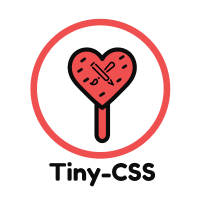

# Tiny CSS

Tiny-CSS is a simple, minimalist, dev-experience friendly, responsive, dark-mode prior, configuration oriented & tiny css framework

It's really tiny, thanks to its [tinifier](https://github.com/tiny-css/compiler) compiler which cuts out most of the unnecessary css style declaration from the source stylesheets & outputs a **project optimized** stylesheet based on the classes used in that file. That outputted css stylesheet is really lighter

Currently the compiler works with only **HTML** files or some markup that finally statically generates HTML but we'll bring support for major front-end frameworks such as **React, Angular, Vue, Svelte** etc via various bundler

## Doc
Documentation is N/A. But will be published soon

## Contributions
Any kind of contributions are welcomed. Just follow the guidelines on CONTRIBUTING.md

## Social
Join the discussion on [discord](https://discord.gg/CnF733MX)

Follow us on [twitter](https://twitter.com/tiny-css)